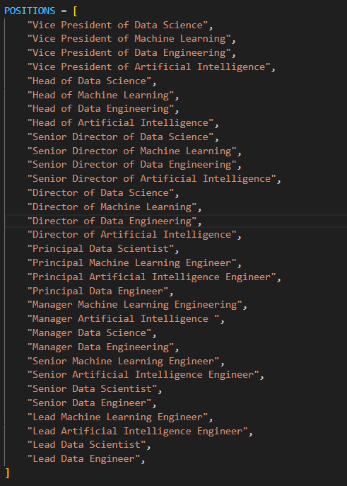
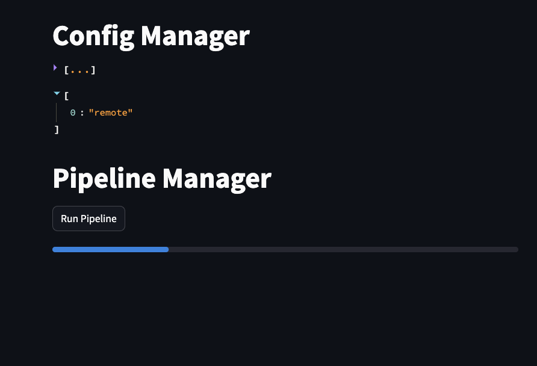

# Installation Guide

This guide will walk you through the installation process for the program. Please follow the steps below to ensure a successful installation.

## Prerequisites

Before proceeding with the installation, please make sure you have the following prerequisites:

- Access to a linux terminal (Mac or Ubuntu) or a WSL on Windows
- Subscription to Rapidapi and the Linkedin Job search service: https://rapidapi.com/jaypat87/api/linkedin-jobs-search

## Step 0: Clone the repository
Clone the repository to your local environment.


## Step 1: Copy the .env-template

To begin, we need to copy the `.env-template` file into `.env` so that the program can work properly. Use the following command to accomplish this:

```shell
cp .env-template .env
```

## Step 2: Add your Rapid API Key

Next, open the `.env` file in a text editor and add your Rapid API Key. This key is required for the program to function correctly. If you don't have a Rapid API Key, you can sign up for one [here](https://www.rapidapi.com/).


## Step 3: Update the job titles and locations you'd like to search for by opening up the config.py file located here: 

```shell
jobhunter/src
```

Update the lists below




## Step 4: Upload your resume in .txt format

You will need to add your resume as ```resume.txt```

to the following location:

```
jobhunter/temp/resumes/resume.txt
```

## Step 5: Test the program

To ensure that everything is set up correctly, run the following command to run the tests:

```shell
make check
```

If there are no errors, then everything is working properly.


## Step 6: Create a Docker image then create container and pass the .env file

To create a Docker image, you need to run the appropriate Docker command on the Dockerfile. Make sure you have Docker installed on your system. If you don't have Docker installed, you can download it from the official website [here](https://www.docker.com/products/docker-desktop).

```shell
sh run_docker.sh
```

## Step 7: Hit the Run Pipeline button to start your job search.


That's it! You have successfully installed the program. 

** You should be able to access the application in your browser by clicking **

```http://localhost:8501/```


You should see the UI like this:




If you encounter any issues during the installation process, please refer to the documentation or seek assistance from the support team.
