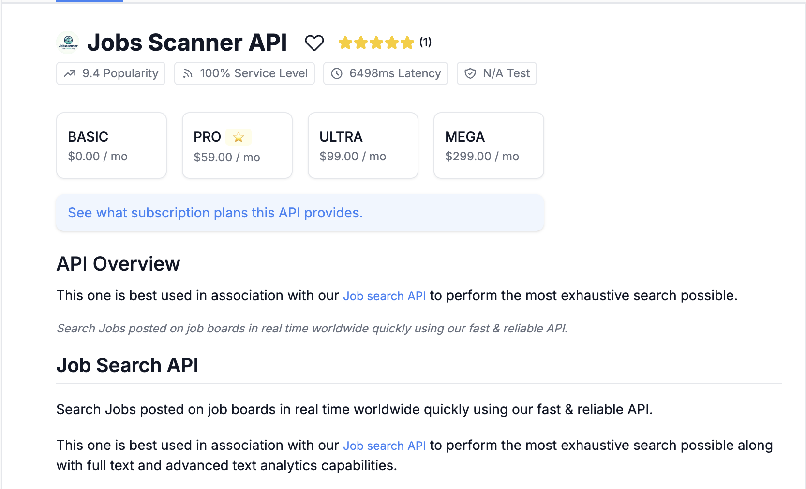

# Installation Guide

📋 This guide will walk you through the installation process for the program. Please follow the steps below to ensure a successful installation.

## Prerequisites

Before proceeding with the installation, please make sure you have the following prerequisites:

- Access to a Linux terminal (Mac or Ubuntu) or a WSL on Windows
- Python 3.11 or higher
- [Poetry](https://python-poetry.org/) installed (see Step 0 below)
- Subscription to Rapid API Job Scanner API: [Rapidapi](https://rapidapi.com/jaypat87/api/linkedin-jobs-search)
- Subscription to OpenAI API: [OpenAI](https://platform.openai.com/apps) (Paid plan likely required, see Step 2)

## Step 0: Clone Repository and Install Dependencies with Poetry

This project uses [Poetry](https://python-poetry.org/) for dependency management.

1.  **Clone the repository:**
    ```bash
    git clone https://github.com/your-username/GPT-Jobhunter.git # Replace with the actual repo URL
    cd GPT-Jobhunter
    ```
2.  **Install Poetry:** If you don't have Poetry installed, follow the official instructions [here](https://python-poetry.org/docs/#installation).
3.  **Install project dependencies:**
    ```bash
    poetry install
    ```
    This command creates a virtual environment automatically (if one doesn't exist) and installs all required packages specified in `pyproject.toml`.

## Step 1: Copy the .env-template

To begin, we need to copy the `.env-template` file into `.env` so that the program can read your API keys. Use the following command in the project's root directory:

```bash
cp .env-template .env
```

## Step 2: Add Required API Keys

Next, open the newly created `.env` file in a text editor and add your API Keys.

### Add Rapid API KEY
This key is required for searching jobs via the external API. If you don't have a Rapid API Key for the LinkedIn Jobs Search API, you can sign up for one [here](https://rapidapi.com/jaypat87/api/linkedin-jobs-search). Add it to the `RAPID_API_KEY` variable in the `.env` file.



### Add OpenAI API KEY
You **must** add an OpenAI API key to the `.env` file to get GPT-based resume similarity scores and enable core job matching features. Add it to the `OPENAI_API_KEY` variable. You can sign up for OpenAI API access [here](https://platform.openai.com/apps).

**Important Note on OpenAI Usage:** Generating embeddings (required for similarity scores) can consume a significant amount of your OpenAI quota. The free tier provided by OpenAI might have strict usage limits and may not be sufficient. If you encounter `429 - insufficient_quota` errors in the application logs, it means you have exceeded your plan's limits. You will likely need to:
*   Add payment details and credits to your OpenAI account.
*   Ensure you have a positive balance or are on an appropriate paid usage plan.
Check your usage and billing details on the [OpenAI Platform](https://platform.openai.com/).

## Step 3: Verify Installation (Optional)

You can run linters or tests if configured in the project (e.g., using `poetry run pytest`). Refer to the project's testing documentation if available.

# Running the Application

Once dependencies are installed and the `.env` file is configured, you can run the application using Poetry.

## Running the Streamlit UI

This is the primary way to use the application. To start the web interface, run:
```bash
poetry run streamlit run jobhunter/main.py
```
You can then access the UI in your browser, usually at `http://localhost:8501/`.

## Running the Command Line Interface (CLI)

(Optional) If you need to use the command-line interface components directly (e.g., for specific search tasks):
```bash
# Example: Get help for the main CLI entrypoint
poetry run jobhunter --help
# Example: Get help for a specific command like 'search' (if available)
# poetry run jobhunter search --help
```
*Refer to the CLI's specific help output for available commands and options.*

# Running with Docker

Alternatively, you can run the application using Docker. Ensure you have Docker installed ([Docker Desktop](https://www.docker.com/products/docker-desktop)).

1.  **Ensure `.env` file is ready:** Make sure you have copied `.env-template` to `.env` and added your API keys as described in Step 1 and Step 2.
2.  **Build the Docker image:** From the project's root directory, run:
    ```bash
    docker build -t gpt-jobhunter .
    ```
3.  **Run the Docker container:** This command runs the container, passes the `.env` file for secrets, and maps the Streamlit port (8501) to your host machine.
    ```bash
    docker run --env-file .env -p 8501:8501 --rm gpt-jobhunter
    ```
    * The `--rm` flag automatically removes the container when it stops.
    * You can then access the UI at `http://localhost:8501/`.

**Using the Convenience Script:**
The provided `run_docker.sh` script might automate some of these steps. Review the script to understand its actions before running it:
```bash
sh run_docker.sh
```

# Final Step: Access the Application

Whether running via Poetry or Docker, you should be able to access the application in your browser by navigating to `http://localhost:8501/`.

ℹ️ NOTE: Check the terminal where you ran the application (either `poetry run` or `docker run`) to see logs and monitor its status.

You should see the UI like this:


If you encounter any issues during the installation or running process, please double-check the steps, consult the terminal logs, or submit an issue to this repository.
