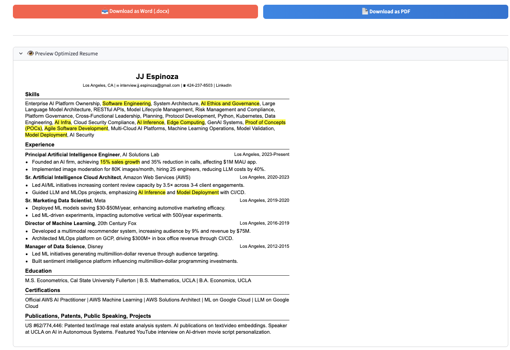
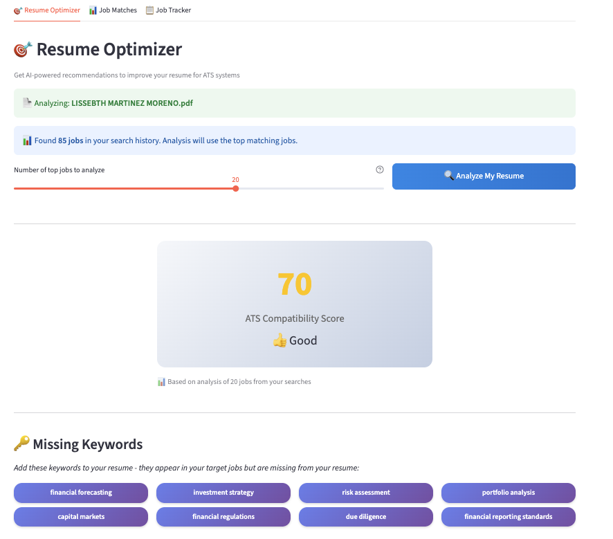
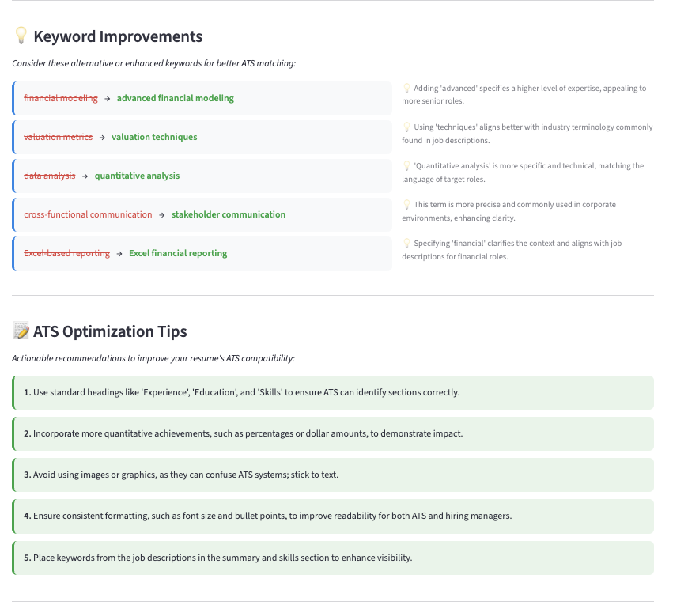
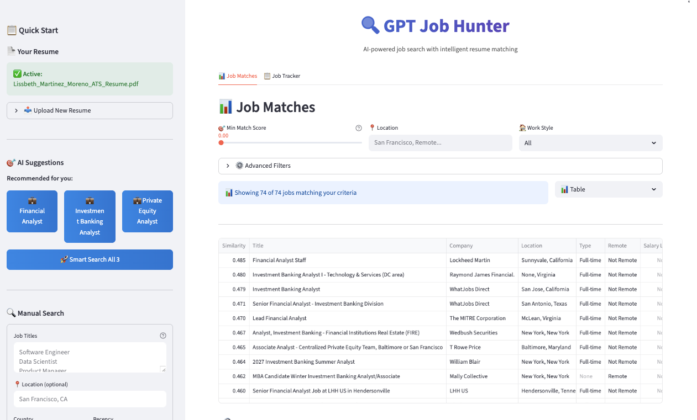
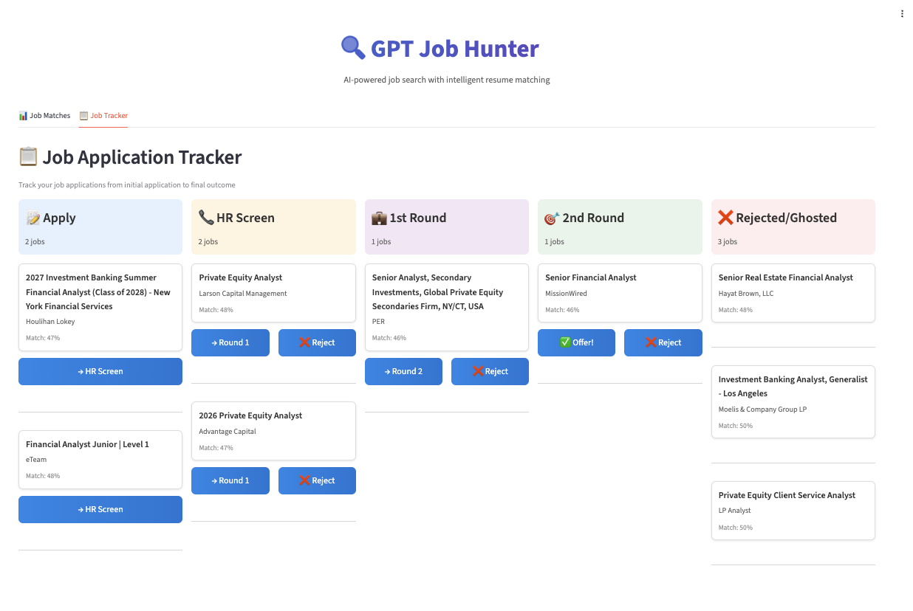

# 🔍 GPT Job Hunter

> **AI-powered job search with ATS optimization that actually understands your resume**

Stop manually searching through hundreds of job postings and wondering why you're not getting interviews. GPT Job Hunter uses advanced AI to optimize your resume for ATS systems, find jobs that match your skills, and automatically score each opportunity - so you can focus on jobs where you'll succeed.

[](https://opensource.org/licenses/MIT)
[](https://www.python.org/downloads/)
[](https://fastapi.tiangolo.com)
[](https://streamlit.io)

---

## 🎥 Watch It In Action

See GPT Job Hunter in action! This demo shows the complete workflow from resume upload to job matching:

[](https://youtu.be/4583HitSHdg)

**[▶️ Watch the demo on YouTube](https://youtu.be/4583HitSHdg)**

---

## ✨ What Makes GPT Job Hunter Different?

### ⚡ **Automatic Resume Analysis** - Instant Insights

Upload your resume and GPT Job Hunter **automatically analyzes it** the moment you finish onboarding. Get instant ATS compatibility scores, missing keywords, and optimization tips without lifting a finger. Your analysis is ready before you even search for jobs.

### 🤖 **AI-Powered Resume Rewriting** - Tailor Your Resume to Win

Here's the game-changer: GPT Job Hunter finds your top job matches, then **automatically rewrites your entire resume** to match exactly what those employers want. Your skills and experience stay the same, but the wording, keywords, and focus are perfectly optimized for the positions you're targeting. No more generic resumes—every application gets a custom-tailored version.


*Your resume, rewritten and optimized for the jobs you're going after*

### 🎯 **SmartSearch AI** - Your Personal Job Scout

Our AI instantly generates **personalized job search suggestions** tailored to your background. No more guessing which job titles to search for - GPT Job Hunter knows what you're qualified for.

### 🧠 **Intelligent Resume Matching**

Every job gets an **AI-powered similarity score** (0-100%) showing how well it matches your resume. Focus on the opportunities where you'll actually succeed, not just any job posting.

### 🎨 **ATS Resume Optimizer** - Beat The Bots

Get your resume past Applicant Tracking Systems with AI-powered optimization. Our analyzer provides:
- **ATS Compatibility Score** (0-100) showing how well your resume performs with automated systems
- **Missing Keywords** that appear in target jobs but not in your resume
- **Keyword Improvements** suggesting better alternatives for existing terms
- **Actionable ATS Tips** for formatting, structure, and content optimization

Analyze against your actual job searches or use AI's general knowledge - either way, you'll know exactly what to fix.

### 📊 **Visual Job Application Tracker**

Manage your entire job search pipeline with a beautiful **Kanban-style board**. Track applications from "Apply" → "HR Screen" → "1st Round" → "2nd Round" → "Offer" - all in one place.

---

## 🖼️ Screenshots

### ATS Resume Optimizer - Beat The Bots

*Get an instant ATS compatibility score and see how your resume stacks up against automated screening systems*


*Receive personalized recommendations including missing keywords, keyword improvements, and actionable ATS tips*

### Job Matches - Find Your Perfect Role

*SmartSearch AI suggests relevant job titles, then ranks every opportunity by match score*

### Job Application Tracker - Stay Organized

*Kanban board to track your applications through every interview stage*

---

## 🚀 Key Features

### For Job Seekers

- **⚡ Automatic Resume Analysis** - *NEW* Your resume is analyzed instantly after upload with zero extra clicks
- **🎯 Streamlined Onboarding** - *NEW* Upload resume → Automatic analysis → Results ready in seconds
- **🤖 AI-Powered Resume Rewriting** - *NEW* Automatically rewrites your entire resume tailored to the top jobs you match
- **🤖 AI Job Suggestions** - Get personalized job title recommendations based on your resume
- **📈 Smart Ranking** - Every job scored 0-100% based on resume match quality
- **🎨 ATS Resume Optimizer** - Get AI-powered analysis with compatibility scores, missing keywords, and optimization tips
- **🔑 Keyword Analysis** - Discover what keywords ATS systems are looking for in your target jobs
- **🔍 Advanced Filters** - Filter by location, salary, remote work, job type, and more
- **📋 Application Tracking** - Kanban board to manage your entire job search pipeline
- **📄 Multi-Resume Support** - Store multiple resumes for different roles
- **⚡ Batch Actions** - Open multiple job applications at once
- **💡 Real-time Insights** - Analyze against your actual job searches for targeted recommendations

### Technical Highlights

- **🏗️ Decoupled Architecture** - FastAPI backend + Streamlit frontend for scalability
- **🧬 OpenAI Embeddings** - State-of-the-art text similarity using GPT models
- **📡 RESTful API** - Full API access with OpenAPI/Swagger docs
- **💾 Efficient Storage** - SQLite database with optimized batch operations
- **🐳 Docker Ready** - One-command deployment with Docker Compose
- **🧪 Tested** - Comprehensive test suite included

---

## 🎯 Perfect For

- 📊 **Data Analysts** searching for roles matching their tech stack and optimizing resumes for ATS
- 💼 **Recent Graduates** exploring what jobs fit their degree and learning what keywords employers want
- 🔄 **Career Switchers** finding relevant opportunities and ensuring resumes pass ATS screening
- 🚀 **Professionals** managing multiple job applications efficiently with optimized resumes
- 🎓 **Students** tracking internship opportunities and building ATS-friendly resumes early
- 📝 **Anyone** tired of submitting applications into the void and never hearing back

---

## ⚡ Quick Start

```bash
# 1. Clone the repository
git clone https://github.com/yourusername/GPT-Jobhunter.git
cd GPT-Jobhunter

# 2. Set up your API keys
cp .env.example .env
# Edit .env and add:
#   OPENAI_API_KEY=your_key
#   RAPID_API_KEY=your_key

# 3. Start the application
make dev

# 4. Open your browser
# Frontend: http://localhost:8501
# API Docs: http://localhost:8000/docs
```

**Full installation guide:** See [INSTALLATION.md](INSTALLATION.md)

---

## 🎬 How It Works

### 1️⃣ **Upload Your Resume**
Simply drag-and-drop your resume (PDF or TXT) during the quick onboarding. GPT Job Hunter extracts your skills, experience, and qualifications.

### 2️⃣ **Get Instant Analysis** ⚡ *NEW*
The moment you complete onboarding, GPT Job Hunter **automatically analyzes your resume** and redirects you to your results. No extra clicks needed - your ATS compatibility score (0-100), missing keywords, and optimization tips are ready immediately.

### 3️⃣ **Get AI-Powered Suggestions**
Click "SmartSearch AI ✨" and instantly receive job title recommendations that match your background.

### 4️⃣ **Browse Ranked Results**
Every job is scored 0-100% based on how well it matches your resume. Focus on high-scoring opportunities first.

### 5️⃣ **Track Your Applications**
Save promising jobs to your Kanban board and move them through your application pipeline as you progress.

### 6️⃣ **Land Interviews Faster**
Apply to the right jobs with an optimized resume, stay organized, and spend less time searching.

---

## 🔑 API Keys Required

GPT Job Hunter needs two API keys to function:

- **OpenAI API Key** - For AI-powered features ([Get it here](https://platform.openai.com/api-keys))
  - Cost: ~$0.02 per 1,000 jobs analyzed
  - Used for: Resume similarity scoring, SmartSearch suggestions, and ATS optimization analysis

- **RapidAPI Key** - For job search ([Get it here](https://rapidapi.com/letscrape-6bRBa3QguO5/api/jsearch))
  - Free tier: 1,000 searches/month
  - Used for: Fetching job listings from multiple sources

---

## 🛠️ Built With

- **[FastAPI](https://fastapi.tiangolo.com/)** - High-performance Python API framework
- **[Streamlit](https://streamlit.io/)** - Beautiful frontend framework
- **[OpenAI](https://openai.com/)** - GPT-powered embeddings for resume matching
- **[SQLite](https://www.sqlite.org/)** - Lightweight, serverless database
- **[Pandas](https://pandas.pydata.org/)** - Data manipulation and analysis
- **[Poetry](https://python-poetry.org/)** - Modern Python dependency management

---

## 📚 Documentation

- **[Installation Guide](INSTALLATION.md)** - Detailed setup instructions
- **[API Documentation](http://localhost:8000/docs)** - Interactive API reference (when running)
- **[Architecture Guide](CLAUDE.md)** - Technical architecture and development guide

---

## 🤝 Contributing

We welcome contributions! Here's how to get started:

1. Fork the repository
2. Create a feature branch (`git checkout -b feature/AmazingFeature`)
3. Make your changes
4. Add tests for new functionality
5. Ensure all tests pass (`pytest tests/`)
6. Commit your changes (`git commit -m 'Add some AmazingFeature'`)
7. Push to the branch (`git push origin feature/AmazingFeature`)
8. Open a Pull Request

---

## 📈 Roadmap

### ✅ Recently Completed
- [x] **Automatic Resume Analysis** - Zero-click workflow that analyzes resumes instantly after onboarding
- [x] **Streamlined Onboarding** - Auto-redirect to optimization results with pre-populated insights
- [x] **ATS Resume Optimizer** - AI-powered resume analysis with compatibility scores and keyword suggestions

### 🚀 Coming Soon
- [ ] **Browser Extension** - Apply directly from LinkedIn/Indeed
- [ ] **Email Alerts** - Get notified of new high-match jobs
- [ ] **Cover Letter Generator** - AI-powered cover letters for each application
- [ ] **Interview Prep** - AI-generated interview questions for each job
- [ ] **Salary Insights** - Market data for each position
- [ ] **Multi-User Support** - Team job hunting for bootcamps/universities
- [ ] **Mobile App** - Track applications on the go

---

## 💡 Use Cases

### For Individuals
- **Active Job Seekers** - Apply to 3x more relevant jobs in the same time
- **Passive Candidates** - Keep an eye on opportunities that match your skills
- **Career Explorers** - Discover what roles you're qualified for

### For Organizations
- **Bootcamp Students** - Help graduates find their first tech role
- **University Career Centers** - Support students in their job search
- **Recruiting Agencies** - Match candidates to opportunities faster

---

## 🐛 Known Limitations

- Currently searches US-based job listings only
- Requires paid OpenAI API access for resume matching
- Best results with tech/professional roles
- Job data freshness depends on RapidAPI provider

---

## 📄 License

This project is licensed under the MIT License - see the [LICENSE](LICENSE) file for details.

---

## 🙏 Acknowledgments

- OpenAI for their incredible embedding models
- The Streamlit team for making beautiful UIs easy
- FastAPI for the blazing-fast backend framework
- All the open-source contributors who made this possible

---

## 📞 Support

- **Issues**: [GitHub Issues](https://github.com/yourusername/GPT-Jobhunter/issues)
- **Discussions**: [GitHub Discussions](https://github.com/yourusername/GPT-Jobhunter/discussions)
- **Email**: support@gptjobhunter.com *(if applicable)*

---

<div align="center">

**⭐ Star this repo if GPT Job Hunter helped you land your dream job! ⭐**

Made with ❤️ by job seekers, for job seekers

[Get Started](INSTALLATION.md) • [Report Bug](https://github.com/yourusername/GPT-Jobhunter/issues) • [Request Feature](https://github.com/yourusername/GPT-Jobhunter/issues)

</div>
