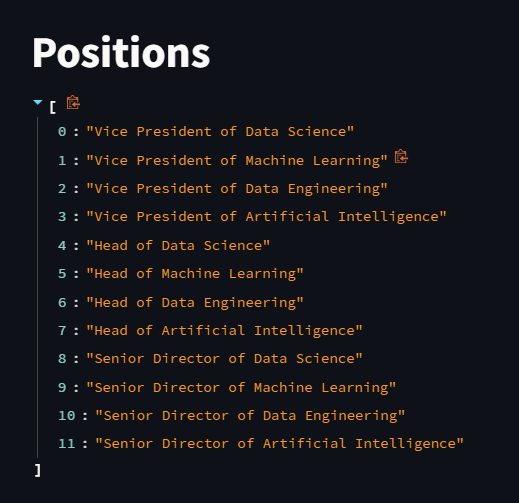
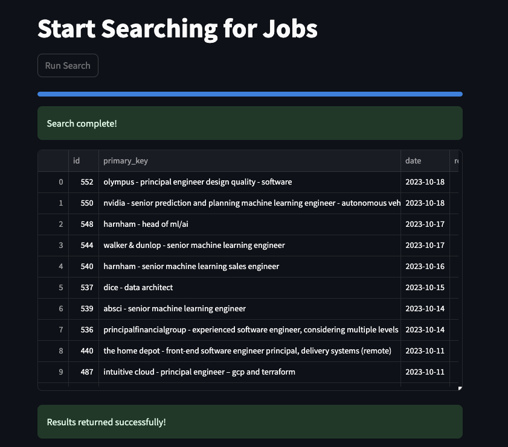

### GPT-Jobhunter 📋

🤖 AI-powered job analysis tool using GPT. Analyzes job postings and provides personalized recommendations to job seekers based on their resume. 📝

## Features 🌟

### Highly Configurable Job Searching 🧐

### Automated Job Search Pipeline 🚀

### AI Based Job-to-Resume Similarity Scores 📊

### Automated Salary Extraction from Job Description 💰

## Quick Start Guide 🚀

[Quickstart](INSTALL.md)

## Contributing 🤝

[Contributing](CONTRIBUTING.md)

## License

[License](LISENSE.md)