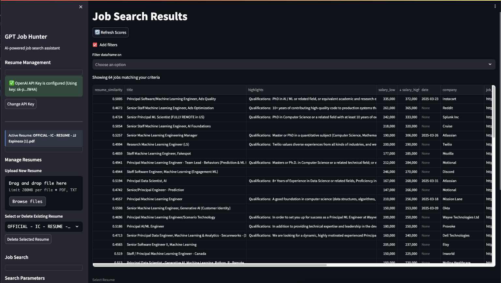

### 💰 **Jobhunter**:  
Jobhunter is an **AI-powered job search assistant** that saves you countless hours in your job hunt by **automatically matching your resume to relevant job postings**. Instead of manually reading through hundreds of listings, Jobhunter analyzes your resume and **scores each job based on how well it matches your skills and experience**. The platform uses **advanced AI** to understand both job descriptions and your qualifications, prioritizing positions where you're most likely to be a strong candidate. With **similarity scores** ranging from 0-1, you can instantly identify the best opportunities and **focus your time on applying to jobs that match your profile**, dramatically streamlining your job search process and increasing your chances of successful applications.

<a href="https://buymeacoffee.com/jjespinozag" target="_blank">
    
</a>

## Features 🌟

### Modern Streamlined UI with Enhanced User Experience


Our newly redesigned user interface offers a seamless, intuitive experience with numerous improvements:

- **Responsive Design**: Clean, modern interface that works well on different screen sizes
- **Intelligent Waiting**: Automatic countdown timers when processing large job batches (now 20 seconds)
- **Interactive Filters**: Powerful filtering system to narrow down job results
- **Resume Management**: Easy uploading, selection, and management of multiple resumes
- **Visual Feedback**: Clear progress indicators and success/error messages
- **Similarity Score Refresh**: One-click refresh button to update resume-to-job matching scores
- **Job Result Prioritization**: Jobs automatically sorted by similarity to your resume
- **Dark Mode Interface**: Easy on the eyes during long job search sessions

## Key Capabilities

### Resume Analysis and Management
- Upload PDF or TXT resumes for AI-powered analysis
- Store and switch between multiple resumes
- Delete outdated resumes with confirmation safeguards

### Comprehensive Job Search
- Search multiple job titles simultaneously
- Filter by country, time frame, and location
- Results automatically analyzed against your resume

### Smart Similarity Scoring
- OpenAI-powered embedding technology compares your resume to job listings
- Automatic calculation of similarity scores (0-1 scale)
- One-click refresh button with 20-second processing time
- Results sorted by relevance to your qualifications

### Powerful Search Results Management
- Filter jobs by any criteria (similarity score, title, company, etc.)
- Open job application links directly from the interface
- View comprehensive job details including salary and requirements

## Comprehensive Installation & Quickstart Guide 🚀

> **IMPORTANT: API KEY REQUIREMENTS**
> 
> Before proceeding with installation, you must obtain:
> 
> 1. **OpenAI API Key** - Required for resume matching and similarity scoring
>    - Sign up at [OpenAI Platform](https://platform.openai.com/api-keys)
>    - A paid tier is strongly recommended as embedding generation uses significant quota
> 
> 2. **RapidAPI JSearch API Key** - Required for job searches
>    - Subscribe to [JSearch API on RapidAPI](https://rapidapi.com/letscrape-6bRBa3QguO5/api/jsearch)
>    - Sign up for RapidAPI and subscribe to the JSearch service
>    - Copy your API key from the RapidAPI dashboard

### Prerequisites
- Python 3.11 or higher
- [Poetry](https://python-poetry.org/) for Python option
- [Docker](https://www.docker.com/products/docker-desktop) for Docker option
- API Keys (as described above)

### Option 1: Python with Poetry (Recommended for Development)

1. **Clone the repository**
   ```bash
   git clone https://github.com/your-username/GPT-Jobhunter.git
   cd GPT-Jobhunter
   ```

2. **Set up environment**
   ```bash
   # Install Poetry if needed
   # curl -sSL https://install.python-poetry.org | python3 -
   
   # Install dependencies
   poetry install
   
   # Create .env file with your API keys
   cp .env-template .env
   # Edit the .env file to add your API keys
   ```

3. **Run the application**
   ```bash
   poetry run streamlit run jobhunter/main.py
   ```
   
4. **Access the application** at http://localhost:8501 in your browser

### Option 2: Docker (Recommended for Deployment)

Our Docker setup includes automated environment preparation, comprehensive testing, and security checks.

1. **Clone the repository & prepare environment**
   ```bash
   git clone https://github.com/your-username/GPT-Jobhunter.git
   cd GPT-Jobhunter
   
   # Create .env file with your API keys
   cp .env-template .env
   # Edit the .env file to add your API keys
   ```

2. **Run the convenience script** (recommended)
   ```bash
   # Make the script executable if needed
   chmod +x run_docker.sh
   
   # Run the script
   ./run_docker.sh
   ```
   
   This script will:
   - Create necessary directories
   - Run tests to validate the codebase
   - Build an optimized Docker image
   - Perform security checks
   - Start the container with appropriate settings
   
3. **Access the application** at http://localhost:8501 in your browser

   **View logs with:**
   ```bash
   docker logs -f gpt-jobhunter
   ```

4. **Manual Docker commands** (if you prefer not to use the script)
   ```bash
   # Build the Docker image
   docker build -t gpt-jobhunter .
   
   # Run the container
   docker run -d --name gpt-jobhunter --env-file .env -p 8501:8501 gpt-jobhunter
   ```


**Important Note on OpenAI Usage:** 
Generating embeddings for similarity scores consumes a significant amount of your OpenAI quota. The free tier may not be sufficient. If you encounter `429 - insufficient_quota` errors, you will need to upgrade to a paid plan.

## Contributing 🤝

[Contributing](CONTRIBUTING.md)

## License

[License](LICENSE)


   
